# INFRA-36 - DevSecOps e Pipeline de Entrega Segura

> **Prioridade:** ALTO
> **Depende de:** BACK-05, BACK-11, INFRA-19, SHRD-33
> **É dependência de:** 22, 23
> **Categoria:** infra

## 1. O Pipeline de Confiança Zero

Nenhum código entra em produção sem passar pelos "Portões de Qualidade".

```mermaid
graph LR
    Code[Code Commit] --> Lint[Lint & Style]
    Lint --> Test[Unit & Integration Tests]
    Test --> SAST[Static Security Scan]
    SAST --> SCA[Dependency Scan]
    SCA --> Build[Build Container]
    Build --> DAST[Dynamic Security Scan]
    DAST --> Deploy[Deploy Staging]
    Deploy --> E2E[End-to-End Tests]
    E2E --> Prod[Deploy Production]
```

---

## 2. Automação de Segurança (SAST/DAST/SCA)

### SAST (Static Application Security Testing)
- Análise do código fonte em busca de padrões inseguros (ex: uso de `eval()`, SQL strings não parametrizadas).
- Ferramentas: SonarQube, Snyk Code.

### SCA (Software Composition Analysis)
- Verificação de vulnerabilidades conhecidas (CVEs) em bibliotecas externas (npm, pip).
- Bloqueio automático de builds se houver vulnerabilidades de nível "CRITICAL".

### DAST (Dynamic Application Security Testing)
- Testes contra o ambiente de staging em execução para encontrar falhas de configuração e lógica em tempo de execução.

---

## 3. Estratégias de Deploy Profissional

### Canary Deployments
1. Lançar a nova versão para apenas **5%** dos usuários.
2. Monitorar métricas de erro e latência (doc 22).
3. Se as métricas estiverem estáveis, expandir para 25%, 50% e 100%.
4. Em caso de anomalia, **Rollback Automático**.

### Blue/Green Deployment
- Dois ambientes idênticos. O tráfego é trocado instantaneamente via Load Balancer após validação completa do novo ambiente.

---

## 4. Gestão de Segredos (Secret Management)

- **Nunca** salvar chaves de API, senhas de banco ou tokens no código ou no CI/CD em texto claro.
- Uso obrigatório de um Vault (ex: AWS Secrets Manager, HashiCorp Vault ou Doppler).
- Rotação automática de chaves a cada 90 dias.

---

## 5. Infraestrutura como Código (IaC)

Toda a infraestrutura deve ser versionada e auditável.
- **GitOps:** Mudanças na infra (mais memória, novas rotas) devem ser feitas via Pull Request em arquivos de configuração (Terraform/Pulumi).

---

## 6. Checklist de Pipeline

- [ ] Linting bloqueando commits com erros.
- [ ] Cobertura mínima de testes configurada (ex: 70%).
- [ ] Scan de segredos ativo (impede subir chaves para o Git).
- [ ] Registro de todos os deploys em logs de auditoria.
- [ ] Dashboard de monitoramento de saúde do pipeline.
