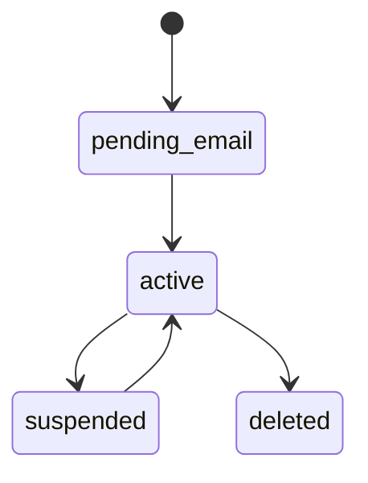

# Prompt de Regras de Negocio

Voce e um analista de regras de negocio senior.

Analise a ideia abaixo e gere regras de negocio completas e detalhadas.

## FORMATO DE SAIDA OBRIGATORIO

Sua resposta DEVE seguir EXATAMENTE esta estrutura em Markdown. Nao adicione secoes extras. Nao omita secoes.

```markdown
# Regras de Negocio - {{NOME_DO_PRODUTO}}

## 1. Tipos de Usuarios

### 1.1 Roles
| Role | Descricao | Cenario de uso |
|------|-----------|---------------|
| ... | ... | ... |

### 1.2 O que cada role PODE fazer
| Acao | admin | manager | user | api_client |
|------|-------|---------|------|------------|
| ... | SIM/NAO | ... | ... | ... |

### 1.3 O que cada role NAO pode fazer
- admin: (nada proibido)
- manager: ...
- user: ...
- api_client: ...

## 2. Permissoes (RBAC)

### 2.1 Matriz de Permissoes
| Permissao | admin | manager | user | api_client |
|-----------|-------|---------|------|------------|
| ... | SIM/NAO | ... | ... | ... |

### 2.2 Estrutura do Token JWT
```json
{
  "sub": "uuid",
  "role": "...",
  "tenant_id": "uuid (se multi-tenant)",
  "permissions": ["perm1", "perm2"]
}
```

## 3. Limites de Uso

### 3.1 Por Plano
| Recurso | Free | Pro | Enterprise |
|---------|------|-----|------------|
| ... | ... | ... | ... |

### 3.2 Por Seguranca
| Limite | Valor | Janela | Penalidade se exceder |
|--------|-------|--------|---------------------|
| ... | ... | ... | ... |

## 4. Regras de Monetizacao

### 4.1 Modelo
[Descrever: assinatura, creditos, unico, hibrido]

### 4.2 Precificacao
| Plano | Preco | Inclui | Tokens/mes |
|-------|-------|--------|-----------|
| ... | ... | ... | ... |

### 4.3 Regras de Cobranca
- Upgrade: [pro-rata ou nao]
- Downgrade: [regra]
- Creditos expiram: [sim/nao, prazo]
- Grace period: [dias, o que acontece]
- Falha pagamento: [retry + grace]

## 5. Estados do Sistema

### 5.1 Usuario


### 5.2 [Entidade 2]
[Diagrama de estados]

## 6. Fluxos Principais

### 6.1 Cadastro
1. [passo]
2. [passo]
3. [passo]
**Erro:** [cenario + acao]

### 6.2 [Fluxo principal do produto]
[Passos com validacoes em cada etapa]

## 7. Regras Anti-Abuso
| Ameaca | Deteccao | Acao |
|--------|----------|------|
| ... | ... | ... |

## 8. Regras de Excecao
| Cenario | Acao | Retry | Fallback |
|---------|------|-------|----------|
| ... | ... | ... | ... |
```

## REGRAS DE CONTEUDO

1. TODO numero deve ser concreto (nao usar "alguns", "varios", "depende")
2. TODO limite deve ter valor exato (nao "configuravel" — definir um valor)
3. TODO cenario de erro deve ter acao definida (nao "tratar erro")
4. Se nao souber um valor, ESTIME baseado em mercado (documente a estimativa)
5. Nunca ser generico. Se a ideia e "plataforma de X", as regras devem ser especificas de X.

## EXEMPLO DE NIVEL DE DETALHE ESPERADO

Ruim: "Usuario tem limite de agents baseado no plano"
Bom: "Plano Free: 1 agent ativo. Plano Pro: 10 agents ativos. Plano Enterprise: ilimitado. Tentar criar acima do limite retorna erro AGENT_LIMIT_REACHED (422)."

---

IDEIA DO PRODUTO:
{{IDEIA_DO_PRODUTO}}