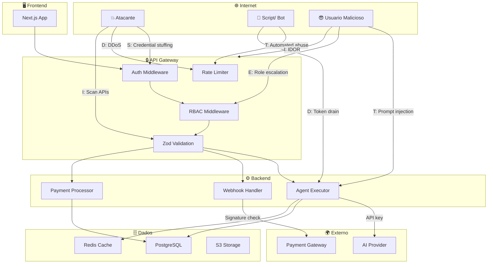
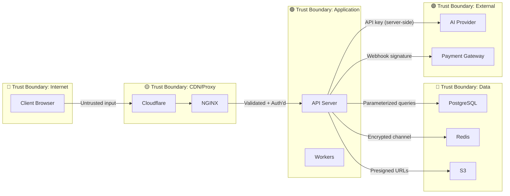

# SHRD-56 - Threat Model

> **Prioridade:** CRITICO
> **Depende de:** BACK-05
> **É dependência de:** AI-10, INFRA-21, OPS-23
> **Categoria:** shared

## 1. Metodologia: STRIDE

| Ameaca | O que significa | Exemplo no sistema |
|--------|----------------|-------------------|
| **S**poofing | Fingir ser outro | Login com credenciais roubadas |
| **T**ampering | Alterar dados | Modificar webhook, injetar prompt |
| **R**epudiation | Negar acao | "Nao fui eu que executei" |
| **I**nformation Disclosure | Vazar dados | API key no log, dados de outro tenant |
| **D**enial of Service | Derrubar sistema | Rate limit bypass, consumo excessivo de tokens |
| **E**levation of Privilege | Escalar permissoes | User vira admin, api_client acessa /admin |

## 2. Diagrama de Ameacas

## 3. Threats por Componente

### 3.1 Autenticacao (Auth)

| ID | Ameaca | STRIDE | Severidade | Mitigacao | Status |
|----|--------|--------|-----------|----------|--------|
| AUTH-01 | Credential stuffing | S | Alto | Rate limit 5/15min + lockout | ✅ |
| AUTH-02 | Brute force JWT | S | Medio | RS256 + expiracao 15min | ✅ |
| AUTH-03 | Token theft (XSS) | I | Critico | httpOnly cookies, CSP | ✅ |
| AUTH-04 | Refresh token replay | S | Alto | Rotation a cada uso | ✅ |
| AUTH-05 | Session hijacking | S | Alto | Revogacao ao detectar | ✅ |
| AUTH-06 | Password spraying | S | Medio | Rate limit global | ✅ |
| AUTH-07 | Account enumeration | I | Medio | Mensagem generica no login | ✅ |
| AUTH-08 | Stolen reset token | S | Medio | Expiracao 1h + single use | ✅ |

### 3.2 Agent Execution

| ID | Ameaca | STRIDE | Severidade | Mitigacao | Status |
|----|--------|--------|-----------|----------|--------|
| AGT-01 | Prompt injection direto | T | Critico | Sanitize + detect + tag delimiters | ✅ |
| AGT-02 | Indirect prompt injection | T | Alto | Filter URLs, sanitize docs | ✅ |
| AGT-03 | Jailbreak (DAN mode) | T | Alto | System prompt hardening | ✅ |
| AGT-04 | Context leak (API key) | I | Critico | Never put secrets in prompt | ✅ |
| AGT-05 | Output filter bypass | I | Medio | Regex + patterns | ✅ |
| AGT-06 | Token drain (abuse) | D | Alto | Credit limit + rate limit | ✅ |
| AGT-07 | Model escalation | E | Medio | Model allowed by plan | ✅ |
| AGT-08 | Agent reads other user data | I | Critico | Owner check + tenant isolation | ✅ |

### 3.3 Pagamentos

| ID | Ameaca | STRIDE | Severidade | Mitigacao | Status |
|----|--------|--------|-----------|----------|--------|
| PAY-01 | Fake webhook | T | Critico | Signature validation (HMAC) | ✅ |
| PAY-02 | Replay webhook | T | Alto | Idempotency key + Redis | ✅ |
| PAY-03 | Double credit | T | Critico | Idempotency + DB transaction | ✅ |
| PAY-04 | Amount manipulation | T | Critico | Server-side amount, never trust client | ✅ |
| PAY-05 | Chargeback fraud | R | Alto | Monitor + flag + history | ✅ |
| PAY-06 | Refund abuse | T | Medio | Manual review > 7 days | ✅ |
| PAY-07 | Gateway credential leak | I | Critico | Env var + encrypted at rest | ✅ |
| PAY-08 | Race condition in credit | T | Alto | Mutex / DB transaction | ✅ |

### 3.4 API

| ID | Ameaca | STRIDE | Severidade | Mitigacao | Status |
|----|--------|--------|-----------|----------|--------|
| API-01 | SQL injection | T | Critico | Prisma ORM (no raw SQL) | ✅ |
| API-02 | XSS in responses | T | Medio | Output filter + CSP header | ✅ |
| API-03 | IDOR (Insecure Direct Object Ref) | I | Critico | Owner check middleware | ✅ |
| API-04 | Mass assignment | T | Alto | Zod strip unknown + whitelist | ✅ |
| API-05 | Rate limit bypass | D | Medio | Multi-layer (IP + user + route) | ✅ |
| API-06 | CORS misconfiguration | I | Medio | Whitelist origins, not * | ✅ |
| API-07 | SSRF via agent URLs | T | Alto | URL allowlist + no internal IPs | ✅ |
| API-08 | Sensitive data in response | I | Alto | Never return password_hash, api_key | ✅ |

### 3.5 Infraestrutura

| ID | Ameaca | STRIDE | Severidade | Mitigacao | Status |
|----|--------|--------|-----------|----------|--------|
| INF-01 | DDoS volumetric | D | Alto | Cloudflare + NGINX rate limit | ✅ |
| INF-02 | SSH brute force | S | Medio | Key-only + fail2ban | ✅ |
| INF-03 | Container escape | E | Critico | Non-root + read-only fs | ✅ |
| INF-04 | DB exposure | I | Critico | No public IP + firewall | ✅ |
| INF-05 | Secret in git | I | Critico | .gitignore + env vars + scanning | ✅ |
| INF-06 | Backup theft | I | Alto | Encrypted backups + S3 restricted | ✅ |
| INF-07 | Supply chain attack | T | Medio | Lock file + audit npm | ✅ |
| INF-08 | Log injection | T | Medio | Structured logging + pino redact | ✅ |

### 3.6 Multi-Tenant

| ID | Ameaca | STRIDE | Severidade | Mitigacao | Status |
|----|--------|--------|-----------|----------|--------|
| TEN-01 | Cross-tenant data access | I | Critico | tenant_id filter + RLS | ✅ |
| TEN-02 | Tenant enumeration | I | Medio | Generic error messages | ✅ |
| TEN-03 | BYOK key theft | I | Critico | AES-256-GCM + env var key | ✅ |
| TEN-04 | Resource hogging by tenant | D | Alto | Per-tenant rate limits | ✅ |

## 4. Trust Boundaries

### Regras por Trust Boundary

| Boundary | Input confia? | Output protege? | Validacao |
|----------|-------------|----------------|-----------|
| Internet → CDN | NAO | CORS + Rate limit | Body size 1MB |
| CDN → App | PARCIAL | Headers + Auth | Rate limit per IP |
| App → DB | SIM (interno) | Parameterized queries | Zod + Prisma |
| App → External | NAO | API key server-side | Timeout + retry |
| External → App | NAO | Signature validation | Idempotency |

## 5. Matriz de Risco

| Risco | Probabilidade | Impacto | Risco Total | Mitigacao Prioridade |
|-------|-------------|--------|-------------|---------------------|
| Prompt injection | Alta | Critico | **CRITICO** | Implementar AGT-01 |
| API key leak | Media | Critico | **CRITICO** | Implementar INF-05, AGT-04 |
| Webhook forgery | Media | Critico | **CRITICO** | Implementar PAY-01 |
| Cross-tenant access | Baixa | Critico | **ALTO** | Implementar TEN-01 |
| DDoS | Media | Alto | **ALTO** | Implementar INF-01 |
| Credential stuffing | Alta | Medio | **ALTO** | Implementar AUTH-01 |
| IDOR | Media | Critico | **ALTO** | Implementar API-03 |
| Credit race condition | Baixa | Critico | **ALTO** | Implementar PAY-08 |

## 6. Checklist

- [ ] Todas as ameacas mapeadas com STRIDE
- [ ] Trust boundaries definidos
- [ ] Mitigacoes implementadas (marcar Status ✅)
- [ ] Matriz de risco priorizada
- [ ] Review trimestral (ameacas mudam)
- [ ] Novas features = novo threat model
- [ ] Penetration testing anual