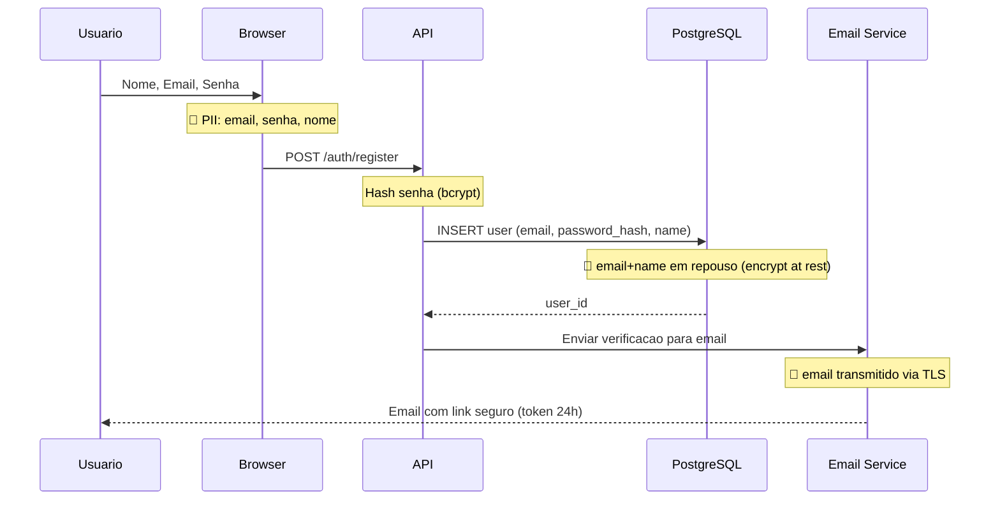
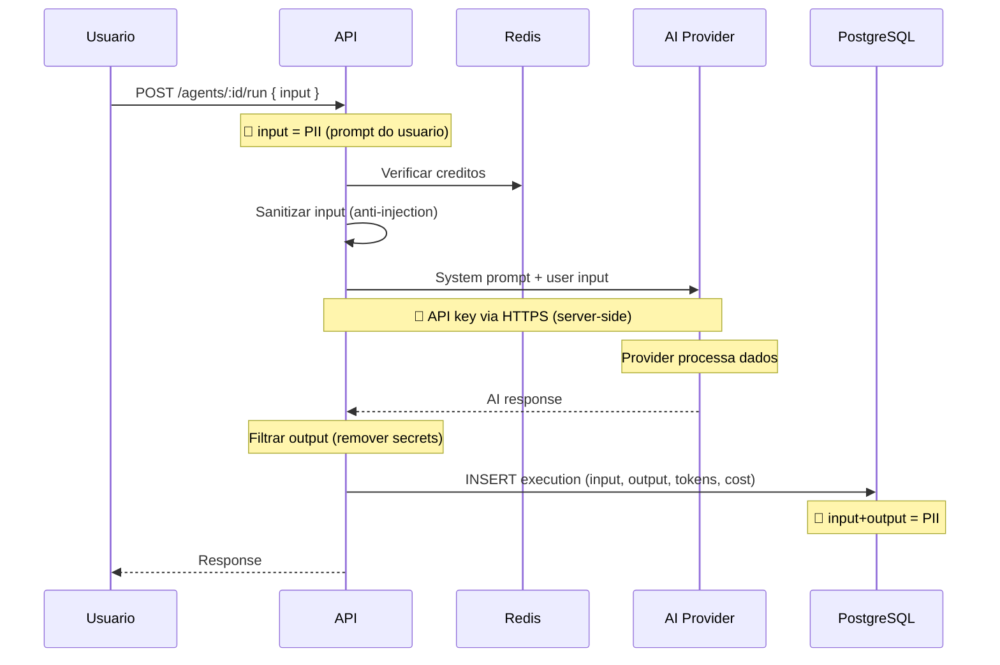
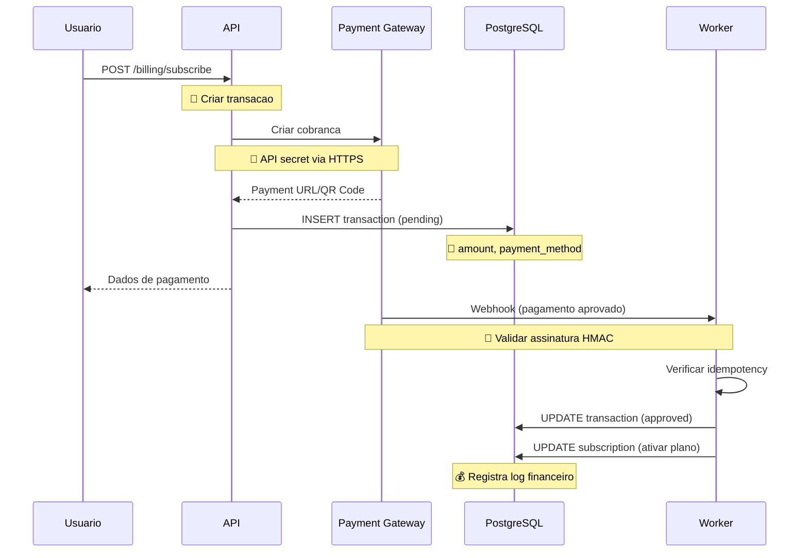
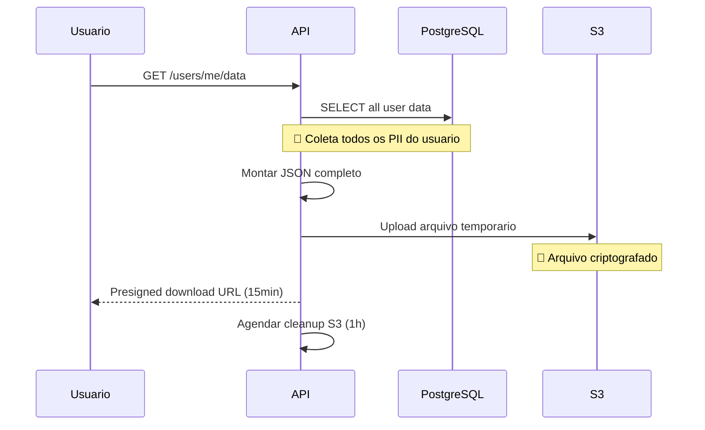
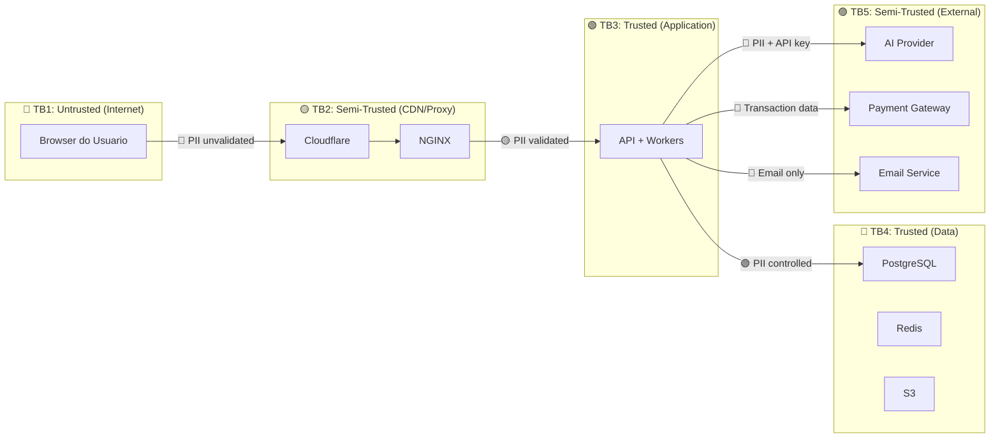

# SHRD-57 - Data Flow Diagram (PII + Trust Boundaries)

> **Prioridade:** CRITICO
> **Depende de:** CORE-01, BACK-05
> **É dependência de:** AI-38
> **Categoria:** shared

## 1. Diagrama de Fluxo de Dados

```mermaid
graph TD
    subgraph User["👤 Usuario"]
        Browser["Browser"]
    end

    subgraph App["🖥 Aplicacao"]
        API["API Server"]
        Worker["BullMQ Worker"]
        WS["WebSocket Server"]
    end

    subgraph Store["💾 Armazenamento"]
        DB[("PostgreSQL")]
        Redis[("Redis")]
        S3[("S3/MinIO")]
    end

    subgraph External["🌍 Externo"]
        Provider["AI Provider"]
        PayGateway["Payment Gateway"]
        Email["Email Service"]
    end

    Browser -->|"1. Email + Senha 🔴PII"| API
    Browser -->|"2. Prompt texto 🟡PII"| API
    Browser -->|"3. Upload arquivo 🟡PII"| S3
    
    API -->|"4. User data 🟡PII"| DB
    API -->|"5. Session 🟢| Redis
    API -->|"6. User prompt 🔴PII"| Provider
    API -->|"7. Transaction 💰"| PayGateway
    API -->|"8. Email address 🔴PII"| Email
    
    Provider -->|"9. AI response 🟢| API
    PayGateway -->|"10. Webhook 💰"| Worker
    Email -->|"11. Delivery 🟢| Browser

    WS -->|"12. Notifications 🟢| Browser
    Worker -->|"13. Update status 🟢| DB
```

## 2. Classificacao de Dados

| Nivel | Cor | Descricao | Exemplos | Criptografia |
|-------|-----|-----------|----------|-------------|
| 🔴 Sensivel | Vermelho | PII + financeiro | Email, senha, IP, prompts, valor transacao | AES-256-GCM em repouso, TLS em transito |
| 🟡 Parcial | Amarelo | PII derivado ou contextual | Nome, historico execucao, config agent | TLS em transito |
| 🟢 Publico | Verde | Sem PII | Status, contagens, metadados anonimizados | N/A |

## 3. Fluxos de Dados Detalhados

### Fluxo 1: Cadastro



**Dados envolvidos:**

| Dado | Tipo | Onde fica | Criptografia | Retencao |
|------|------|----------|-------------|---------|
| Email | 🔴 Sensivel | DB users.email | AES em repouso | Enquanto conta ativa |
| Senha | 🔴 Sensivel | DB users.password_hash | bcrypt (1-way) | Enquanto conta ativa |
| Nome | 🟡 Parcial | DB users.name | TLS transito | Enquanto conta ativa |
| Verification token | 🔴 Sensivel | Redis | TTL 24h | 24h |
| IP | 🔴 Sensivel | DB user_sessions.ip_address | N/A | 30 dias |

### Fluxo 2: Execucao de Agent



**Dados envolvidos:**

| Dado | Tipo | Onde fica | Criptografia | Retencao |
|------|------|----------|-------------|---------|
| User prompt (input) | 🔴 Sensivel | DB agent_executions.input | TLS transito | Enquanto conta ativa |
| AI response (output) | 🟡 Parcial | DB agent_executions.output | TLS transito | Enquanto conta ativa |
| Tokens usados | 🟢 Publico | DB agent_executions.tokens_used | N/A | 5 anos (financeiro) |
| Custo | 🟢 Publico | DB agent_executions.cost | N/A | 5 anos (financeiro) |
| API key do provider | 🔴 Sensivel | DB providers.api_key_encrypted | AES-256-GCM | Rotacao 90 dias |
| User IP | 🔴 Sensivel | DB usage_logs.ip_address | N/A | 30 dias |

### Fluxo 3: Pagamento



**Dados envolvidos:**

| Dado | Tipo | Onde fica | Criptografia | Retencao |
|------|------|----------|-------------|---------|
| Valor | 🔴 Sensivel | DB transactions.amount | N/A | 5 anos (legal) |
| Metodo pagamento | 🟡 Parcial | DB transactions.payment_method | N/A | 5 anos |
| Gateway transaction ID | 🟢 Publico | DB transactions.gateway_transaction_id | N/A | 5 anos |
| Credit card number | 🔴 Sensivel | NAO ARMAZENAR | N/A | 0 (nunca) |
| Webhook signature | 🟢 Publico | Validado e descartado | N/A | 0 (nunca) |

### Fluxo 4: Exportacao de Dados (LGPD)



## 4. Trust Boundaries



### Regras por Trust Boundary

| Cruzando | Dado tipo | Validacao | Criptografia | Log |
|----------|---------|-----------|-------------|-----|
| TB1 → TB2 | 🔴 PII | Zod + sanitize | TLS (client) | Nao logar PII |
| TB2 → TB3 | 🟡 PII | Rate limit + auth | TLS (internal) | CorrelationId |
| TB3 → TB4 | 🟢 Controlled | Parameterized | TLS + AES at rest | Audit log |
| TB3 → TB5 | 🔴 API key | Server-side only | TLS + AES at rest | Nao logar key |
| TB5 → TB3 | 🟢 Response | Signature check | TLS | Log result |
| TB4 → TB1 | 🟢 Safe output | Filter | TLS | Nao logar PII |

## 5. PII Inventory (Inventario de Dados Pessoais)

| Dado | Fonte | Storage | Criptografia | Quem acessa | Retencao | Deletavel |
|------|-------|---------|-------------|-----------|---------|----------|
| Email | Cadastro | DB users.email | AES-256 at rest | Sistema + usuario | Ativo | Sim (LGPD) |
| Nome | Cadastro | DB users.name | TLS transit | Sistema + usuario | Ativo | Sim (LGPD) |
| Senha | Cadastro | DB users.password_hash | bcrypt (1-way) | Ninguem (verifica apenas) | Ativo | Sim (muda) |
| IP | Requisicao | DB usage_logs.ip_address | N/A | Admin (30 dias) | 30 dias | Auto |
| User prompt | Execucao | DB agent_executions.input | TLS transit | Usuario (proprio) | Ativo | Sim (LGPD) |
| AI response | Execucao | DB agent_executions.output | TLS transit | Usuario (proprio) | Ativo | Sim (LGPD) |
| Payment method | Pagamento | DB transactions.payment_method | N/A | Admin + usuario | 5 anos | Nao (legal) |
| Transaction amount | Pagamento | DB transactions.amount | N/A | Admin + usuario | 5 anos | Nao (legal) |
| Session data | Login | Redis | N/A | Sistema | 7 dias | Sim (logout) |
| Device info | Login | DB user_sessions.device_info | N/A | Admin | 7 dias | Auto |

## 6. Checklist

- [ ] Todos os fluxos de PII mapeados
- [ ] Trust boundaries definidos com regras
- [ ] Inventario PII completo (o que, onde, quanto tempo)
- [ ] Criptografia em repouso para dados 🔴
- [ ] TLS em todo transito
- [ ] Nenhum PII em logs
- [ ] Credit card number NUNCA armazenado
- [ ] Exportacao de dados funcional (LGPD)
- [ ] Delecao de dados funcional (LGPD)
- [ ] Review trimestral do inventario PII