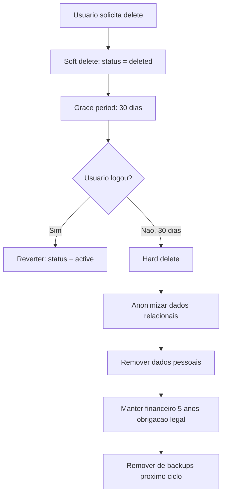
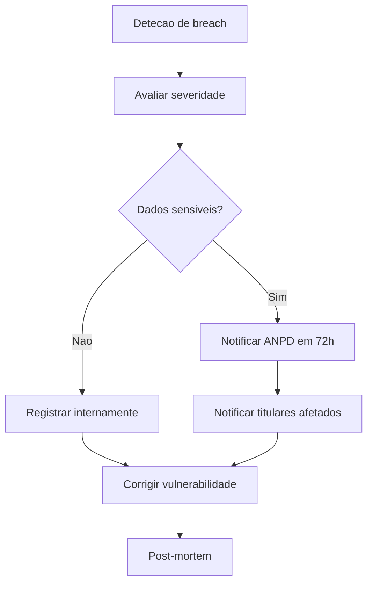

# SHRD-61 - LGPD Compliance Detalhado

> **Prioridade:** MEDIO
> **Depende de:** BACK-05, SHRD-57-data-flow
> **É dependência de:** (nenhum)
> **Categoria:** shared

## 1. Base Legal

| Artigo | Resumo | Como cumprimos |
|--------|--------|---------------|
| Art. 6 | Legalidade, finalidade, adequacao | Dados coletados so para fim especifico |
| Art. 7 | Bases legais | Consentimento + contrato + obrigacao legal |
| Art. 17 | Direito de apagamento | DELETE /users/me + exportacao |
| Art. 18 | Direito de acesso | GET /users/me/data |
| Art. 20 | Direito de portabilidade | Exportar em formato JSON |
| Art. 56-57 | Sancoes | Multa ate 2% faturamento (max R$ 50M) |

## 2. Dados Coletados (Inventario Completo)

| Dado | Finalidade | Base Legal | Retencao | Sensivel? | Destinatario |
|------|-----------|-----------|---------|----------|-------------|
| Email | Autenticacao + comunicacao | Contrato | Ativo + 5 anos pos deletao | Sim | Email service |
| Nome | Identificacao | Contrato | Ativo | Nao | — |
| Senha (hash) | Autenticacao | Contrato | Ativo | Sim | — |
| IP | Seguranca + conformidade | Interesse legitimo | 30 dias | Sim | — |
| Device info | Seguranca | Interesse legitimo | 7 dias | Nao | — |
| Prompts (input) | Processamento de IA | Contrato | Ativo | Sim | AI Provider |
| Respostas IA (output) | Servico | Contrato | Ativo | Contextual | — |
| Metodo pagamento | Processar cobranca | Contrato | 5 anos | Sim | Gateway |
| Valor transacao | Financeiro + legal | Obrigacao legal | 5 anos | Sim | — |
| Log de acesso | Seguranca | Interesse legitimo | 90 dias | Sim | — |
| Uploads | Servico | Contrato | Ativo | Contextual | S3 |

## 3. Direitos do Titular (Endpoints)

### Consulta: GET /v1/users/me/data

```json
{
  "success": true,
  "data": {
    "personal": { "name": "...", "email": "..." },
    "agents": [...],
    "executions": [...],
    "transactions": [...],
    "sessions": [...],
    "logs": [...]
  },
  "exported_at": "2026-04-22T10:00:00Z",
  "format": "application/json"
}
```

### Apagamento: DELETE /v1/users/me

```json
{
  "success": true,
  "data": {
    "message": "Account scheduled for deletion",
    "deletes_at": "2026-05-22T00:00:00Z",
    "grace_period_days": 30,
    "can_reverse_until": "2026-05-22T00:00:00Z"
  }
}
```

### Portabilidade: GET /v1/users/me/data?format=json

Retorna todos dados em JSON para download.

## 4. Processo de Delecao



### O que E deletado

| Tabela | Acao | Prazo |
|--------|------|-------|
| users | Hard delete (remove email, name, hash) | 30 dias |
| user_sessions | Delete all | Imediato |
| agents | Delete all | 30 dias |
| agent_executions | Anonimizar (user_id = null) | 30 dias |
| provider_logs | Anonimizar (user_id = null) | 30 dias |
| usage_logs | Delete all | Imediato |
| audit_logs | Anonimizar (actor_id = null) | 30 dias |
| transactions | ANONIMIZAR, NAO DELETAR | Manter 5 anos (legal) |
| subscriptions | Delete | 30 dias |

### O que NAO pode ser deletado por lei

| Dado | Motivo | Prazo |
|------|--------|-------|
| Transaction amount | Obrigacao contabil/fiscal | 5 anos |
| Transaction status | Obrigacao fiscal | 5 anos |
| Transaction date | Obrigacao fiscal | 5 anos |
| Gateway transaction ID | Conciliacao | 5 anos |

**Solucao:** Anonimizar. Remover `user_id`, manter dados financeiros sem vinculo pessoal.

## 5. Conservacao do Consentimento

| Dado | Consentimento | Como obter | Como revogar |
|------|-------------|-----------|-------------|
| Email + Nome | Ao cadastrar | Checkbox obrigatorio | Delete account |
| Prompts de IA | Ao usar agents | Termos de uso | Delete account |
| IP | Implicito (seguranca) | Politica de privacidade | Delete account |
| Comunicacao marketing | Opcional | Checkbox no perfil | Unsubscribe no email |

### Registro de Consentimento

```json
{
  "user_id": "uuid",
  "consents": [
    { "type": "terms_of_service", "version": "1.0", "accepted_at": "2026-04-22T10:00:00Z" },
    { "type": "privacy_policy", "version": "1.0", "accepted_at": "2026-04-22T10:00:00Z" },
    { "type": "marketing_email", "version": "1.0", "accepted_at": "2026-04-22T10:00:00Z", "revoked_at": "2026-05-01T08:00:00Z" }
  ]
}
```

## 6. DPO (Encarregado)

| Funcao | Responsabilidade |
|--------|----------------|
| DPO nomeado? | (a definir — obrigatorio para dados sensiveis em escala) |
| Canal de contato | dpo@dominio.com |
| Registro de solicitacoes | Tabela lgpd_requests (ver abaixo) |

### Tabela: lgpd_requests

| Campo | Tipo | Descricao |
|-------|------|-----------|
| id | UUID | PK |
| user_id | UUID | FK users |
| type | VARCHAR(20) | access, deletion, portability, rectification |
| status | VARCHAR(20) | pending, processing, completed, denied |
| reason_denied | TEXT | NULL ou motivo legal para negar |
| requested_at | TIMESTAMP | Quando pediu |
| completed_at | TIMESTAMP | Quando completou |

**Prazo legal:** 15 dias para responder.

## 7. Incidente de Dados (Data Breach)

### Fluxo



### O que notificar

| Quem | Prazo | O que informar |
|------|-------|--------------|
| ANPD | 72h | Natureza dos dados, numero de afetados, medidas tomadas |
| Titulares | "sem demora justificada" | O que vazou, o que fazer, contato |
| Publico | Se risco alto | Aviso no site + email |

## 8. Checklist LGPD

- [ ] Inventario de dados pessoais completo
- [ ] Bases legais definidas por dado
- [ ] Endpoints de acesso/delecao/portabilidade funcionais
- [ ] Consentimento registrado
- [ ] Delecao com grace period + anonimizacao
- [ ] Dados financeiros mantidos 5 anos
- [ ] DPO nomeado (se aplicavel)
- [ ] Tabela lgpd_requests para registro de solicitacoes
- [ ] Plano de data breach definido
- [ ] Politica de privacidade publicada
- [ ] Termos de uso publicados
- [ ] Cookies com banner de consentimento
- [ ] Email marketing com unsubscribe
- [ ] Contratos com operadores (AI providers, gateway, email)
- [ ] Criptografia em repouso (AES)
- [ ] TLS em todo transito